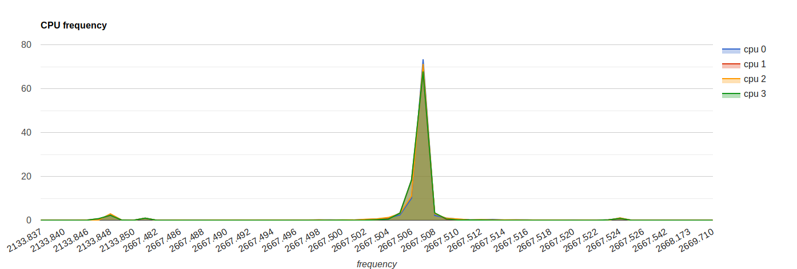

# stateCollector

stateCollector collectin info how often CPU work in certain frequency. 
For now it work only in linux systems(because it works due parsing /proc/cpuinfo). 
If you know how implement this for other OS explain it please.

### How run :

```r
ruby stats.rb
``` 
This run in while loop, so than longer it run then exactlier will statics. 
In output it give `conf.json` file where will have written 
CPU frequency and how many times it was applied, by the end of 
the program runed. But it not human readable, therefore i was wrote
small script whole converts all counts to normal view. 
For run it just execute this:

```
ruby transform.rb
```

In output it gives `out.html` with google chart whole you can open via any browser.
Below you can see example of it's output.


